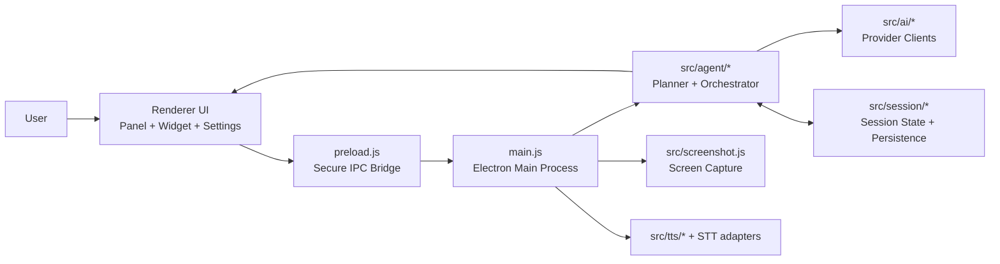

# OpenGuider

Download [here](https://mo-tunn.github.io/OpenGuider/)

  

OpenGuider is an Electron desktop AI assistant designed to help you complete real UI tasks on your machine.

It combines chat, planning, screenshot context, pointer hints, and optional voice features in one desktop workflow.

## What OpenGuider Does

- Converts your goal into a step-by-step execution plan.
- Uses screenshot context to reason about what is currently on screen.
- Gives coordinate-based pointer guidance for "click here" style help.
- Keeps session history so long tasks remain coherent across messages.
- Supports multiple model providers so you can switch based on speed/cost/quality.
- Adds optional speech-to-text and text-to-speech for hands-free usage.

## Feature Breakdown

### 1) Multi-Provider AI Layer

OpenGuider supports:

- Claude
- OpenAI
- Gemini
- Groq
- OpenRouter
- Ollama (local)

Why this matters:

- You can optimize for latency, pricing, or reasoning quality per task.
- You can fail over to another provider if one API is unavailable.
- You can use local models (Ollama) for privacy-sensitive workflows.

### 2) Planning and Task Orchestration

Instead of only returning plain text responses, OpenGuider can:

- build a structured plan,
- track current step,
- replan when state changes,
- and continue until completion.

This makes the app useful for real multi-step operations, not just simple Q/A.

### 3) Screen-Aware Guidance

OpenGuider can reason with screenshot context to produce actionable guidance:

- identify likely UI regions,
- map instructions to on-screen targets,
- emit pointer hints with coordinates.

This is the core of "guide me while I use my apps" behavior.

### 4) Voice Input and Output

Speech-to-text options:

- AssemblyAI
- Whisper-compatible endpoints

Text-to-speech options:

- Google TTS
- OpenAI TTS
- ElevenLabs

You can run chat-only, voice-only, or hybrid flows depending on your setup.

## Live Preview

  

## Downloads

- Landing page: [https://mo-tunn.github.io/OpenGuider/](https://mo-tunn.github.io/OpenGuider/)
- Latest release: [https://github.com/mo-tunn/OpenGuider/releases/latest](https://github.com/mo-tunn/OpenGuider/releases/latest)
- Windows installer: [OpenGuider-windows-setup-latest.exe](https://github.com/mo-tunn/OpenGuider/releases/latest/download/OpenGuider-windows-setup-latest.exe)
- macOS installer (DMG): [OpenGuider-macos-installer-latest.dmg](https://github.com/mo-tunn/OpenGuider/releases/latest/download/OpenGuider-macos-installer-latest.dmg)
- Linux installer: [OpenGuider-linux-latest.zip](https://github.com/mo-tunn/OpenGuider/releases/latest/download/OpenGuider-linux-latest.zip)

## Installation

### Option A: Download Prebuilt App (Recommended)

1. Open the latest release page: [https://github.com/mo-tunn/OpenGuider/releases/latest](https://github.com/mo-tunn/OpenGuider/releases/latest)
2. Download your platform artifact:
   - Windows: `OpenGuider-windows-setup-latest.exe`
   - macOS: `OpenGuider-macos-installer-latest.dmg`
   - Linux: `OpenGuider-linux-latest.zip`
3. Extract and run the app.

### Option B: Run From Source

1. Install dependencies: `npm install`
2. Start the app: `npm run start`

## Configuration Guide (Detailed)

Open Settings in the app and configure in this order.

### Step 1: Choose Your Main LLM Provider

Pick one provider first (you can add others later):

- Claude / OpenAI / Gemini / Groq / OpenRouter / Ollama

Then set:

- provider API key (if required),
- default model,
- and any provider-specific endpoint fields.

Tip:

- Start with a single stable provider before enabling all options.

### Step 2: Select the Default Model

Choose a model based on your use case:

- Fast and cheap for short daily guidance.
- Stronger reasoning model for complex multi-step planning.

If model output quality is inconsistent, switch to a more capable model.

### Step 3: Configure Voice (Optional)

If you want microphone-driven workflows:

1. Select your STT provider.
2. Set language options.
3. Verify system microphone permissions.
4. Run a short recognition test.

For spoken responses:

1. Select TTS provider.
2. Pick voice.
3. Test output volume and speaking speed.

### Step 4: Validate the Setup

Send a simple prompt first, for example:

- "Open settings and guide me to configure notifications step by step."

Then try a planning-style prompt:

- "Help me complete this task in 5 steps and wait for confirmation after each step."

### Step 5: Add Secondary Providers (Optional)

After your main provider works, add backups for reliability:

- Primary provider for default usage.
- Secondary provider for fallback.
- Local Ollama profile for offline/private runs.

## How To Use OpenGuider Effectively

For best results, write goals in this format:

- Context: what app/page you are in.
- Objective: what you want to complete.
- Constraints: things to avoid or mandatory requirements.

Good example:

- "I am in Figma settings. Help me enable autosave and version history safely. Give one step at a time and wait."

## Troubleshooting

- If the AI response is generic:
  - check selected model/provider,
  - include clearer UI context,
  - provide a fresh screenshot context by retrying the step.
- If voice does not work:
  - verify OS microphone permission,
  - verify API key for STT/TTS provider,
  - test with a shorter input phrase.
- If pointer hints are off:
  - capture a fresh screenshot and retry,
  - avoid heavily zoomed/scaled UI when possible.

## Security and Data Handling

OpenGuider is designed as a local-first desktop app. This section explains what data is stored, what may be sent to external providers, and how to operate safely.

### Data Stored Locally

- App settings (provider choices, model selection, preferences) are stored in the Electron `userData` directory.
- Session/task history is stored locally to keep multi-step context coherent.
- Logs are written locally for debugging and runtime diagnostics.
- API keys are stored with secure storage (`keytar`) when available; otherwise encrypted fallback storage is used.

### Data Sent to External Services

Depending on your configuration, OpenGuider may send:

- prompts and conversation context to your selected LLM provider,
- voice audio/text to selected STT/TTS providers,
- screenshot-derived context when screen-aware guidance is used.

Important:

- data is sent only to providers you explicitly configure,
- there is no hidden relay server by default between your app and providers.

### Screenshot and UI Context Handling

- Screenshots are used to improve on-screen guidance and step suggestions.
- For privacy-sensitive tasks, avoid including confidential content on screen before capture.
- If required by policy, disable screen-aware workflows and use text-only guidance.

### Operational Security Best Practices

- Use a dedicated provider API key for OpenGuider (do not reuse high-privilege keys).
- Rotate API keys periodically.
- Never commit `.env` or key files to Git.
- Prefer local model usage (Ollama) for highly sensitive workflows.
- Review logs before sharing them publicly in issues.

### Privacy and Compliance Notes

- OpenGuider is open-source, so security behavior is auditable.
- Compliance posture depends on your selected providers and their data policies.
- If your team has strict requirements, define an approved provider/model list and disable non-approved endpoints.

## Support and Contribution

If you want to support OpenGuider by contributing code, docs, tests, or design updates, this section is for you.

### Branching Strategy for Contributors

- `main`: stable branch used for production-ready updates.
- `feature/<short-name>`: new features.
- `fix/<short-name>`: bug fixes.
- `docs/<short-name>`: README/docs-only changes.
- `chore/<short-name>`: maintenance and tooling updates.

Examples:

- `feature/voice-hotkeys`
- `fix/linux-build-artifact`
- `docs/readme-configuration-guide`

### Recommended Contribution Flow

1. Fork the repository (or create a branch if you are a direct collaborator).
2. Create a new branch from `main`.
3. Keep commits focused and descriptive.
4. Run tests locally: `npm run test`.
5. Push your branch and open a Pull Request.

### Pull Request Checklist

- Explain what changed and why.
- Include test notes (what you ran and results).
- Add screenshots/GIF for UI changes.
- Keep scope small and review-friendly.
- Rebase/merge latest `main` if needed before final review.

### Ways to Help Beyond Code

- Improve docs and onboarding examples.
- Report reproducible bugs with logs/steps.
- Propose UX improvements for panel/widget flows.
- Help test releases on Windows/macOS/Linux.

## Development

- Run with inspector: `npm run dev`
- Run tests: `npm run test`

## Build Installers (Windows/macOS/Linux)

- Build all platform targets on your current OS: `npm run dist`
- Build only Windows NSIS installer (`.exe`): `npm run dist:win`
- Build only macOS installer (`.dmg`): `npm run dist:mac`
- Build only Linux packages (`.AppImage` + `.deb`): `npm run dist:linux`
- Output artifacts are written to `release/`

## Architecture

### Component Roles

- `main.js`: app lifecycle, tray/shortcuts, IPC routing, orchestration entrypoint.
- `preload.js`: secure boundary between renderer and main process APIs.
- `renderer/*`: user-facing UI surfaces (panel, widget, settings, cursor overlay).
- `src/agent/*`: planning, evaluation, replanning, and task progression logic.
- `src/ai/*`: model-provider abstractions and structured response handling.
- `src/session/*`: session model, history continuity, state persistence.

## Security Notes

- API keys are persisted via OS-protected secure storage (`keytar`) when available.
- If keychain is unavailable, encrypted fallback storage is used through Electron safe storage.
- Renderer runs with `contextIsolation: true` and `nodeIntegration: false`.
- Application data is stored in Electron `userData` path under a stable app identity (`OpenGuider`) so updates keep local settings/history.

## GitHub Release Automation

1. Push a semantic version tag (example: `v0.2.0`).
2. GitHub Actions runs `.github/workflows/release-build.yml`.
3. Installers are attached to the release:
   - `OpenGuider-windows-setup-latest.exe`
   - `OpenGuider-macos-installer-latest.dmg`
   - `OpenGuider-linux-latest.zip`

## License

This project is licensed under the GNU General Public License v3.0.  
See [`LICENSE`](./LICENSE) for full terms.

Copyright (C) Metehan Kızılcık

If you create a derivative project, keep these GPLv3 basics:

1. Include the full GPLv3 license text in a `LICENSE` file.
2. Keep copyright notices (including `Metehan Kızılcık`).
3. Share source code of distributed modified versions under GPL-compatible terms.

## Acknowledgement

OpenGuider was originally inspired by Clicky.
